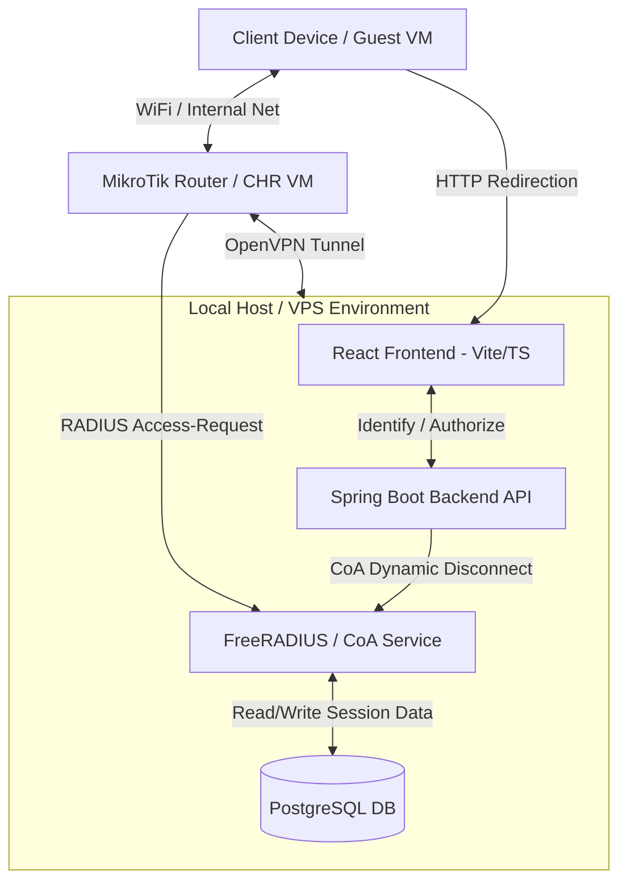

# BilluNet Captive Portal System: Comprehensive Study Guide

This document is a consolidated architectural and developer guide for **BilluNet**, a production-style hotspot captive portal system. It is designed to be uploaded directly to **NotebookLM** (or read by developers) to provide a complete understanding of the codebase structure, database schema, API flows, and router integration mechanics.

---

## 1. System Architecture & Topology



---

## 2. Directory & Repository Map

The repository is structured as a monorepo containing all components needed to run both the central management server and physical/virtual router configurations:

* **`/backend`**:
  * **Framework**: Spring Boot 4.0.5, Java 17+, Maven.
  * **Database Migrations**: Flyway.
  * **Key Features**: JWT-secured admin APIs, guest authentication, SMS OTP validation, mock payment gateway processing, dynamic OpenVPN certificate sign-and-download generation (`VpnCertController`), and router heartbeat telemetry tracking.
* **`/frontend-wifi`**:
  * **Framework**: React, Vite, TypeScript, Bootstrap 5.
  * **Key Features**: Captive Portal flow parsing client MAC addresses, customer phone registration, plan selection, checkout simulators, and an Admin dashboard for managing sites, routers, plans, customers, and active sessions.
* **`/router`**:
  * Contains helper scripts such as [billunet-heartbeat.sh](file:///d:/BIlluProject/Wi-Fi/router/billunet-heartbeat.sh) used to report status from routers.
* **`/guidance`**:
  * Contains setup guides for physical MikroTik hAP lite hardware, VirtualBox sandbox configuration, and developer implementation walkthroughs.

---

## 3. Database Schema & Key Entities

The PostgreSQL database (`billunet`) manages system state. Below are the primary JPA entities defined in `com.wifi.portal.entity`:

### RouterNode
Represents a physical or virtual router node connected to the system. Supports **Multi-Router Auto-Registration** (automatically creates a new database entry on first heartbeat or captive request).
* `routerCode` (String, Unique): Unique identifier for a router (e.g. `DSM-KARUME-001`).
* `managementIp` (String): The VPN or Host-Only private IP used by the backend to poll stats.
* `status` (Enum): `ONLINE`, `OFFLINE`, `DISCOVERED`, `DISABLED`.
* `agentKey` (String): Secure validation key used in heartbeat header validation (`X-Router-Key`).
* `cpuUsage` & `memoryUsage` (Integer): Hardware telemetry.
* `connectedClients` & `authenticatedClients` (Integer): Client counts tracked dynamically.

### Customer
Represents a Wi-Fi guest subscriber.
* `phoneNumber` (String): Phone number (primary identifier).
* `phoneVerified` (Boolean): SMS OTP verification flag.
* `status` (Enum): `ACTIVE`, `BLOCKED`.

### Device
Represents client hardware (phones/laptops) connecting to the hotspot.
* `macAddress` (String, Unique): Device MAC address.
* `customer` (ManyToOne -> Customer): Owner of the device.
* `status` (Enum): `ACTIVE`, `BLOCKED`.

### AccessSession
Represents a device's active internet access window.
* `device` (ManyToOne -> Device) & `customer` (ManyToOne -> Customer).
* `plan` (ManyToOne -> Plan): The plan purchased for this session.
* `startTime` & `endTime` (Instant): Session timestamps.
* `status` (Enum): `ACTIVE`, `EXPIRED`, `PENDING_PAYMENT`.

### Plan
Represents the available billing packages.
* `name` (String) & `priceLabel` (String).
* `durationMinutes` (Integer): Time allocated for this plan.
* `downloadMbps` & `uploadMbps` (Integer): Speed profile bandwidth throttling limits.
* `dataCapMb` (Long): Maximum data allowance (or unlimited).

---

## 4. The Captive Portal Redirect & Handoff Flow

The system intercepts unauthenticated client traffic and directs it through the following multi-step login sequence:

```
[Client]                [MikroTik Router]            [React Portal]            [Spring Backend]
   │                            │                          │                           │
   │─── 1. HTTP Request ───────>│                          │                           │
   │    (e.g., neverssl.com)    │                          │                           │
   │                            │─── 2. Intercept & ──────>│                           │
   │                            │    Redirect with MAC     │                           │
   │                            │                          │─── 3. Identify / Status ─>│
   │                            │                          │    (MAC, Router Code)     │
   │                            │                          │                           │
   │                            │                          │<── 4. Next Step: OTP ─────│
   │<── 5. Render Phone Form ───│                          │                           │
   │                            │                          │                           │
   │─── 6. Enter Verification ──│─────────────────────────>│                           │
   │    (OTP -> Payment)        │                          │─── 7. Verify & Purchase ─>│
   │                            │                          │                           │
   │                            │                          │<── 8. Session Active ─────│
   │                            │<── 9. Authorize Client ──│                           │
   │                            │    (POST /login / PAP)   │                           │
   │<── 10. Access Granted ─────│                          │                           │
```

### Step 1: Interception
When a device connects to the hotspot bridge and requests a non-HTTPS page, the MikroTik Hotspot interceptor triggers and redirects the user to the portal URL configured in the router's `login.html`:
```html
window.location.href = "https://billunet.lupestationery.org/?clientmac=$(mac)&clientip=$(ip)&router_code=YOUR_ROUTER_CODE&link_login=$(link-login-only)&link_orig=$(link-orig-esc)";
```

### Step 2: Portal Identification (`GET /api/portal/status`)
The React portal parses the query parameters:
* `clientmac` / `macAddress`
* `clientip`
* `router_code`
* `link_login` (the endpoint on the router to trigger authorization)
* `link_orig` (the website the user originally requested)

It fires `GET /api/portal/status` to determine what step the client should do next:
* If the MAC has an active session, the API returns `nextStep = CONTINUE`. The frontend immediately directs the browser to login to the router using the `link_login` URL.
* If the phone number is unverified, `nextStep = ENTER_PHONE`.
* If verified but has no active plan, `nextStep = SELECT_PLAN`.
* If plan chosen, `nextStep = PAYMENT`.

### Step 3: Registration, OTP & Mock Payment
1. **OTP Send**: Guest inputs phone number. Backend triggers an OTP code.
2. **OTP Verify**: Guest inputs the code. Backend marks the `Customer` phone as verified.
3. **Plan & Payment**: Guest chooses a plan (e.g. `1 Hour` for `TZS 500`). Backend fires a mock mobile money prompt. Once confirmed, backend transitions the payment status to `SUCCESS` and spins up an `AccessSession` mapped to the client MAC.

### Step 4: Router Login Handoff (`POST /api/captive/continue`)
The client browser makes a final call to authorize internet access. The frontend sends a form submit (via HTTP-PAP) containing the guest's credentials to the router's login gateway (`link-login-only`), which unlocks the client's WAN firewall rules on the router.

---

## 5. Key API Controllers

### VpnCertController
Exposes endpoints to securely generate and download certificates/keys for new routers registering to the system's OpenVPN network:
* `/api/public/vpn/download-cert`: Downloads the private network CA certificate.
* `/api/public/vpn/download-client-cert`: Signs and downloads a client certificate dynamically signed for the request's `routerCode`.
* `/api/public/vpn/download-client-key`: Generates and downloads the client private key on-the-fly.

### RouterAgentController
Maintains router telemetry and heartbeat signals:
* `/api/router-agent/heartbeat` (Endpoint header secured by `X-Router-Key`):
  * Invoked by the router's internal scheduler script every 60 seconds.
  * Dynamically maps CPU load, client density, uptime, and VPN interface IPs to update the admin dashboard.

---

## 6. Local Sandbox Practice via VirtualBox

To simulate the entire environment on your Windows host:
1. **Network Adapters**:
   * **Adapter 1 (WAN)**: Set to **NAT**. Outward internet access for VM interfaces.
   * **Adapter 2 (Hotspot LAN)**: Set to **Internal Network** (`hotspot-lan`). Isolates guest devices.
   * **Adapter 3 (Admin Management)**: Set to **Host-only Adapter** (typically `192.168.56.x`). Connects host-level Winbox directly to the router's management IP (`192.168.56.10`).
2. **Local Spring Boot and React**:
   * Runs on the host PC (`192.168.56.1`).
   * React is run with `npm run dev -- --host` so the sandbox VM browser can connect via `http://192.168.56.1:5173/`.
   * Hotspot walled garden rules are configured on the router to explicitly bypass firewall blocks for the host IP (`192.168.56.1`).
