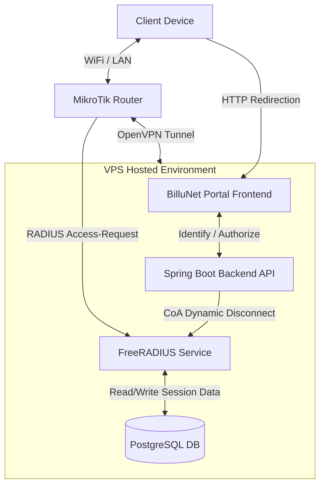

# MikroTik Router Setup & Integration Guide (A to Z)

This guide provides the complete, step-by-step instructions and commands (A to Z) to configure a new **MikroTik RouterOS** router to connect to the BilluNet system hosted on your VPS.

### System Topology & Flow


---

## Step 1: Basic Local Interface & WAN Setup
First, prepare the local interfaces and bridge for hotspot traffic, and ensure the WAN port (`ether1`) is connected to the internet.

```routeros
# 1. Create a bridge for Hotspot clients
/interface bridge
add name=bridge-hotspot comment="Hotspot Client Bridge"

# 2. Add LAN interfaces (e.g., ether2 to ether5) to the Hotspot Bridge
/interface bridge port
add bridge=bridge-hotspot interface=ether2
add bridge=bridge-hotspot interface=ether3
add bridge=bridge-hotspot interface=ether4
add bridge=bridge-hotspot interface=ether5

# 3. Configure IP address for the Hotspot bridge
/ip address
add address=192.168.10.1/24 interface=bridge-hotspot network=192.168.10.0

# 4. Configure WAN DHCP Client on ether1
/ip dhcp-client
add interface=ether1 disabled=no comment="WAN Internet Port"

# 5. Enable masquerade NAT rule for WAN internet access
/ip firewall nat
add chain=srcnat out-interface=ether1 action=masquerade comment="Masquerade for WAN"
```

---

## Step 2: OpenVPN (OVPN) Client Configuration
To securely connect the MikroTik router to your VPS private network containing the FreeRADIUS and API servers.

> [!IMPORTANT]
> **MikroTik RouterOS does not support importing `.ovpn` profile files directly.** Instead, you download the CA certificate, the client certificate, and the client private key, and configure the client connection parameters manually using the commands detailed below.

### 2.1 Bypass Cloudflare Proxies (Static DNS)
To prevent Cloudflare from blocking the router's file downloads and VPN handshakes, add a static DNS entry on the router pointing directly to your VPS IP:
```routeros
/ip dns static add name=billunet-api.lupestationery.org address=178.238.233.102
```

### 2.2 Download Certificates (Zero-Touch On-The-Fly Generation)
Run the following commands on the router terminal to download the CA certificate, and dynamically generate/download the unique client certificate and private key for this router (replace `YOUR_ROUTER_CODE` with your unique identifier, e.g. `router-02`):

```routeros
# Clean any old files
/file remove ca.crt
/file remove client.crt
/file remove client.key

# 1. Download CA certificate
/tool fetch url="https://billunet-api.lupestationery.org/api/public/vpn/download-cert?password=24558" dst-path=ca.crt keep-result=yes check-certificate=no

# 2. Download client certificate (VPS automatically signs and generates this on-the-fly)
/tool fetch url="https://billunet-api.lupestationery.org/api/public/vpn/download-client-cert?password=24558&routerCode=YOUR_ROUTER_CODE" dst-path=client.crt keep-result=yes check-certificate=no

# 3. Download client private key (VPS automatically signs and generates this on-the-fly)
/tool fetch url="https://billunet-api.lupestationery.org/api/public/vpn/download-client-key?password=24558&routerCode=YOUR_ROUTER_CODE" dst-path=client.key keep-result=yes check-certificate=no
```

### 2.3 Import Certificates
Import the files in this sequence (press Enter when prompted for a password during the key import, as the key is not password-protected):
```routeros
/certificate import file-name=ca.crt name=ca.crt
/certificate import file-name=client.crt name=client.crt
/certificate import file-name=client.key name=client.key
```
Verify the certificates are loaded by running `/certificate print`. You should see `client.crt` with a **`K`** (private key present) and **`R`** flags.

### 2.4 Configure OVPN Interface
Add and enable the OpenVPN client interface on the router:
```routeros
/interface ovpn-client
add name=ovpn-billunet \
    connect-to=178.238.233.102 \
    port=1194 \
    mode=ip \
    protocol=tcp \
    user="mikrotik-client-01" \
    profile=default-encryption \
    certificate=client.crt \
    auth=sha256 \
    cipher=aes256-gcm \
    add-default-route=no \
    disabled=no
```
Verify it connects successfully by running `/interface ovpn-client monitor ovpn-billunet once` (should show `status: link established`).

---

## Step 3: Configure RADIUS Client
To delegate authentication, authorization, and session accounting to the VPS FreeRADIUS server.

```routeros
# 1. Add the RADIUS Server (pointing to the VPS VPN Gateway IP)
/radius
add service=hotspot \
    address=10.20.20.1 \
    secret="billunet-radius-secret-2026" \
    authentication-port=1812 \
    accounting-port=1813 \
    timeout=3s \
    comment="BilluNet FreeRADIUS Server"

# 2. Enable RADIUS Incoming (CoA / Disconnect Messages)
# This allows the Spring Boot backend to kick users or update limits in real time
/radius incoming
set accept=yes port=3799
```

---

## Step 4: Configure Hotspot and Profiles
Setup the local DHCP server, User Profile, and Hotspot profile to run PAP authentication using RADIUS.

```routeros
# 1. Create client IP pool
/ip pool
add name=hs-pool ranges=192.168.10.10-192.168.10.254

# 2. Setup DHCP Server on Hotspot Bridge
/ip dhcp-server
add name=dhcp-hotspot interface=bridge-hotspot address-pool=hs-pool disabled=no
/ip dhcp-server network
add address=192.168.10.0/24 gateway=192.168.10.1 dns-server=8.8.8.8,1.1.1.1

# 3. Create Hotspot User Profile (Applied to RADIUS accounts)
/ip hotspot user profile
add name=billunet-profile shared-users=1 idle-timeout=none keepalive-timeout=2m

# 4. Create Hotspot Server Profile
/ip hotspot profile
add name=hsprof-billunet \
    hotspot-address=192.168.10.1 \
    html-directory=hotspot \
    login-by=http-pap \
    use-radius=yes \
    nas-port-type=19 \
    radius-default-domain="" \
    radius-location-id="" \
    radius-location-name="" \
    radius-mac-format="XX:XX:XX:XX:XX:XX"

# 5. Create and Enable the Hotspot Server
/ip hotspot
add name=hs-billunet \
    interface=bridge-hotspot \
    address-pool=hs-pool \
    profile=hsprof-billunet \
    disabled=no
```

---

## Step 5: Hotspot Walled Garden Configuration
Before logging in, clients must be allowed to reach the portal web application and any payment gateways. Add these destinations to bypass the hotspot wall.

```routeros
/ip hotspot walled-garden
# 1. Allow the BilluNet Portal Domains (Frontend & Backend APIs)
add dst-host=billunet.lupestationery.org action=allow
add dst-host=billunet-api.lupestationery.org action=allow

# 2. Allow Local VPN Subnet Access (for Dev/Tunnel environments)
add dst-host=10.20.20.1 action=allow

# 3. Allow ClickPesa Gateway
add dst-host=*.clickpesa.com action=allow
add dst-host=clickpesa.com action=allow

# 4. Allow Flutterwave Gateway
add dst-host=*.flutterwave.com action=allow
add dst-host=flutterwave.com action=allow

# 5. Allow Google Fonts (used by Portal Front-end UI)
add dst-host=fonts.googleapis.com action=allow
add dst-host=fonts.gstatic.com action=allow
```

---

## Step 6: Captive Portal Redirect Page (`login.html`)
Replace the contents of the `login.html` file inside your MikroTik router's hotspot HTML directory (typically `flash/hotspot/login.html` or `hotspot/login.html`) with the exact template provided by the system:

```html
<!DOCTYPE html>
<html>
<head><meta charset="utf-8"></head>
<body>
<script>
window.location.href =
  "https://billunet.lupestationery.org/?" +
  "clientmac=$(mac)&clientip=$(ip)" +
  "&router_code=YOUR_ROUTER_CODE" +
  "&link_login=$(link-login-only)&link_orig=$(link-orig-esc)";
</script>
</body>
</html>
```
### Configuration:
* Replace `YOUR_ROUTER_CODE` with the identifier of the router (e.g., `router-02`).

---

## Step 7: Telemetry Heartbeat Script & Scheduler
To keep the router registered as `ONLINE` in the BilluNet admin panel, run this command in the MikroTik Terminal to add a scheduler that posts heartbeat data and its current VPN management IP every 60 seconds:

```routeros
/system scheduler
add name="billunet-hb" interval=60s on-event={\
  /tool fetch url="https://billunet-api.lupestationery.org/api/router-agent/heartbeat" \
    http-method=post \
    http-header-field="Content-Type: application/json,X-Router-Key: YOUR_AGENT_KEY" \
    http-data="{\\\"routerCode\\\":\\\"YOUR_ROUTER_CODE\\\",\\\"managementIp\\\":\\\"YOUR_MANAGEMENT_IP\\\",\\\"routerName\\\":\\\"YOUR_ROUTER_NAME\\\"}" \
    keep-result=no check-certificate=no}
```

### Configuration:
* Replace `YOUR_AGENT_KEY` with the generated security key for this router (obtained from the admin dashboard under the router details).
* Replace `YOUR_ROUTER_CODE` and `YOUR_ROUTER_NAME` with the corresponding values for your router.
* Replace `YOUR_MANAGEMENT_IP` with the dynamically assigned OpenVPN IP of the router (e.g. `10.20.20.2` or `10.20.20.3`).

---

## Step 8: Integration Verification
1. Connect a client device (phone or laptop) to the hotspot network.
2. The device should automatically trigger the redirect page `login.html`, which redirects it to the BilluNet Captive Portal page.
3. Verify that the client is redirected to the URL containing their MAC address and location details.
4. Complete the login or plan purchase.
5. Once authorized, the portal should hit `/api/captive/continue` which outputs the continue redirect url (MikroTik endpoint with username and password) and log you in.
6. The MikroTik router will query FreeRADIUS over the OpenVPN tunnel, fetch the `Access-Accept` response, and permit internet access.
7. Verify that the router appears as `ONLINE` in the BilluNet administration dashboard.
