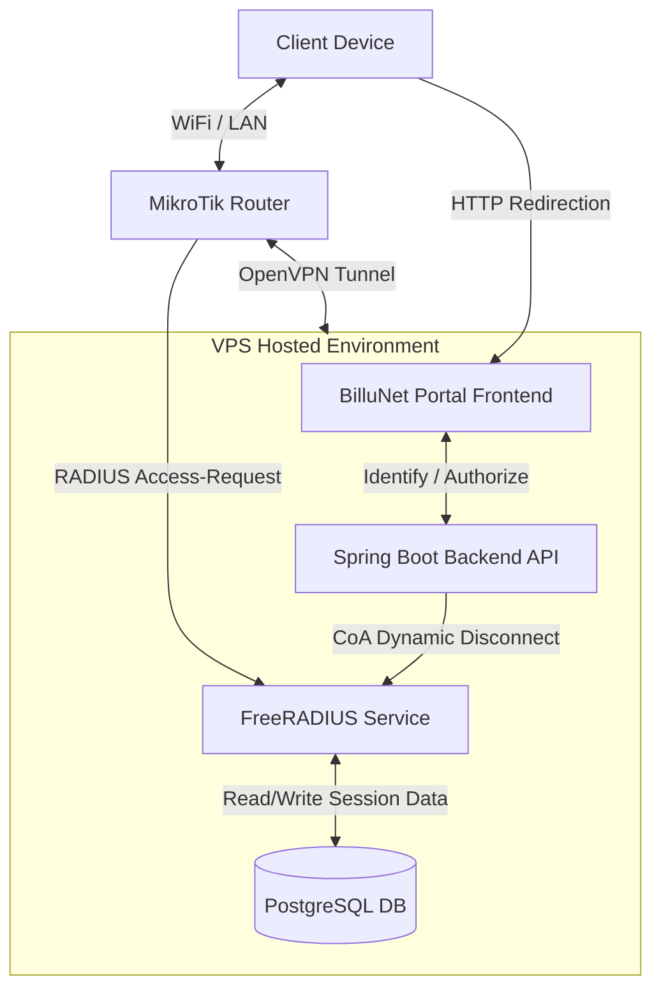

# MikroTik Router Setup & Integration Guide (Default Config Overlay)

This guide provides step-by-step instructions to configure a **MikroTik hAP lite (4-port)** router using its **default factory configuration** as the starting point. This avoids MAC Winbox connection issues and keeps your default internet/firewall settings intact.

### System Topology & Flow


---

### Hardware Port Layout (hAP lite)
* **Port 1 (`ether1`)**: WAN (Connected to your Internet Modem).
* **Port 2 & 3 (`ether2`, `ether3`) + Wi-Fi**: Hotspot clients (Captive Portal active).
* **Port 4 (`ether4`)**: Private Admin Management Port (Captive Portal bypassed).

---

## Phase 1: Connect to Default Router

1. Reset your router to factory defaults if you made changes:
   ```routeros
   /system reset-configuration no-defaults=no skip-backup=yes
   ```
2. Plug your internet source cable into **Port 1 (`ether1`)**.
3. Plug your Admin PC into **Port 2**.
4. Open Winbox, type **`192.168.88.1`** in the "Connect to" box, use username **`admin`** with a blank password, and click **Connect**.

---

## Phase 2: Prevent Router Lockout (Admin Port Setup)

We will remove **Port 4 (`ether4`)** from the default bridge and configure it as a private management interface. When you plug into Port 4, you bypass the captive portal completely so you don't get locked out.

Run these commands in the MikroTik Terminal:

```routeros
# 1. Remove ether4 from the default bridge
/interface bridge port remove [find interface=ether4]

# 2. Assign a separate management IP subnet to ether4
/ip address
add address=192.168.99.1/24 interface=ether4 network=192.168.99.0

# 3. Create an IP Pool for the admin network
/ip pool
add name=admin-pool ranges=192.168.99.10-192.168.99.50

# 4. Configure a DHCP Server on ether4 for your Admin PC
/ip dhcp-server
add name=dhcp-admin interface=ether4 address-pool=admin-pool disabled=no
/ip dhcp-server network
add address=192.168.99.0/24 gateway=192.168.99.1 dns-server=8.8.8.8,1.1.1.1

# 5. Add ether4 to the LAN interface list so the default firewall allows Winbox/SSH/Web access
/interface list member add interface=ether4 list=LAN
```

*Action:* **Unplug your Admin PC's Ethernet cable from Port 2, plug it into Port 4**, and reconnect Winbox to the new IP: **`192.168.99.1`**.

---

## Phase 3: Register Router in Admin Panel

Before configuring the VPN and RADIUS settings, you must register the router in your system:

1. Log into your **BilluNet Admin Panel**.
2. Navigate to **Routers** -> **Add New Router**.
3. Fill in the details to generate:
   * **`YOUR_ROUTER_CODE`**: e.g., `DSM-KARUME-001`
   * **`YOUR_AGENT_KEY`**: The secure telemetry heartbeat validation key.

---

## Phase 4: Secure OpenVPN (OVPN) Connection

To securely connect your router to the VPS private network (where FreeRADIUS and backend APIs reside).

### 4.1 Bypass Cloudflare Proxies (Static DNS)
To prevent Cloudflare from blocking the router's certificate downloads and VPN handshakes, add a static DNS entry on the router pointing directly to your VPS IP:
```routeros
/ip dns static add name=billunet-api.lupestationery.org address=178.238.233.102
```

### 4.2 Download Certificates (Zero-Touch Generation)
Run the following commands on the router terminal to download the CA certificate, and dynamically generate/download the unique client certificate and private key for this router.

> [!NOTE]
> * Replace `YOUR_ROUTER_CODE` with your unique identifier generated in Phase 3.
> * The `password=24558` parameter is the default password mapping to `VPN_DOWNLOAD_PASSWORD` configured on your VPS. If you configured a custom password in your VPS `.env` file, replace `24558` with your custom password.
> * **Zero-Touch Dynamic Allocation:** When you run these fetch commands, the VPS backend automatically reserves a unique private VPN IP address for this router (e.g. `10.20.20.3`) and configures OpenVPN on the server for you.

```routeros
# Clean any old files
/file remove ca.crt
/file remove client.crt
/file remove client.key

# 1. Download CA certificate
/tool fetch url="https://billunet-api.lupestationery.org/api/public/vpn/download-cert?password=24558" dst-path=ca.crt keep-result=yes check-certificate=no

# 2. Download client certificate
/tool fetch url="https://billunet-api.lupestationery.org/api/public/vpn/download-client-cert?password=24558&routerCode=YOUR_ROUTER_CODE" dst-path=client.crt keep-result=yes check-certificate=no

# 3. Download client private key
/tool fetch url="https://billunet-api.lupestationery.org/api/public/vpn/download-client-key?password=24558&routerCode=YOUR_ROUTER_CODE" dst-path=client.key keep-result=yes check-certificate=no
```

### 4.3 Import Certificates
Import the files in this sequence (press Enter when prompted for a password during the key import, as the key is not password-protected):
```routeros
/certificate import file-name=ca.crt name=ca.crt
/certificate import file-name=client.crt name=client.crt
/certificate import file-name=client.key name=client.key
```
Verify the certificates are loaded by running `/certificate print`. You should see `client.crt` with a **`K`** (private key present) and **`R`** flags.

### 4.4 Configure OVPN Interface
Add and enable the OpenVPN client interface on the router:
```routeros
/interface ovpn-client
add name=ovpn-billunet \
    connect-to=178.238.233.102 \
    port=1194 \
    mode=ip \
    protocol=tcp \
    user="mikrotik-client-01" \
    profile=default-encryption \
    certificate=client.crt \
    auth=sha256 \
    cipher=aes256-gcm \
    add-default-route=no \
    disabled=no
```
Verify it connects successfully by running `/interface ovpn-client monitor ovpn-billunet once` (should show `status: link established`).

---

## Phase 5: Enable REST API, Security, & API User

To allow the BilluNet VPS backend to poll active hotspot sessions and wireless registration metrics, you must enable the MikroTik REST API, restrict it for safety, and create a user matching the backend credentials:

```routeros
# 1. Enable the WWW service (required for RouterOS REST API)
/ip service set www disabled=no port=80

# 2. Secure the REST API by allowing access ONLY from the VPN private subnet
# This prevents unauthorized access from WAN or public internet ports
# Note: If your firewall filter list is currently empty, omit the 'place-before=0' parameter.
/ip firewall filter
add chain=input action=accept protocol=tcp dst-port=80 src-address=10.20.20.0/24 comment="Allow BilluNet REST API over VPN"

# 3. Create a dedicated API user on the router
# Replace portal-api and MyStrongPassword with the MIKROTIK_API_USERNAME and MIKROTIK_API_PASSWORD configured in your VPS .env configuration
/user
add name=portal-api group=write password=MyStrongPassword comment="BilluNet Backend REST API User"
```

---

## Phase 6: Configure RADIUS Client

Delegate user authentication, authorization, and accounting to the VPS FreeRADIUS server over the VPN tunnel.

```routeros
# 1. Add the RADIUS Server (pointing to the VPS VPN Gateway IP)
/radius
add service=hotspot \
    address=10.20.20.1 \
    secret="billunet-radius-secret-2026" \
    authentication-port=1812 \
    accounting-port=1813 \
    timeout=3s \
    comment="BilluNet FreeRADIUS Server"

# 2. Enable RADIUS Incoming (CoA / Disconnect Messages)
# This allows the Spring Boot backend to kick users or update limits in real time
/radius incoming
set accept=yes port=3799
```

---

## Phase 7: Configure Hotspot Server and Profiles

We will configure the Hotspot Server to run directly on the default LAN bridge (`bridge`) using the existing DHCP configuration.

```routeros
# 1. Create Hotspot User Profile
/ip hotspot user profile
add name=billunet-profile shared-users=1 idle-timeout=none keepalive-timeout=2m

# 2. Create Hotspot Server Profile (Pointing to the default bridge gateway 192.168.88.1)
/ip hotspot profile
add name=hsprof-billunet \
    hotspot-address=192.168.88.1 \
    html-directory=flash/hotspot \
    login-by=http-pap \
    use-radius=yes \
    nas-port-type=19 \
    radius-default-domain="" \
    radius-location-id="" \
    radius-location-name="" \
    radius-mac-format="XX:XX:XX:XX:XX:XX"

# 3. Create and Enable the Hotspot Server on the default LAN bridge
# Note: Set address-pool to 'none' or replace with your actual DHCP pool name (e.g. hs-pool-1)
/ip hotspot
add name=hs-billunet \
    interface=bridge \
    address-pool=none \
    profile=hsprof-billunet \
    disabled=no
```

---

## Phase 8: Hotspot Walled Garden Configuration

Allow unauthenticated clients to reach the captive portal frontend, the backend API, and payment gateways over both HTTP and HTTPS.

```routeros
/ip hotspot walled-garden ip
# 1. Allow the BilluNet Portal Domains (Frontend & Backend APIs)
add dst-host=billunet.lupestationery.org action=accept
add dst-host=billunet-api.lupestationery.org action=accept
add dst-address=178.238.233.102 action=accept
add dst-address=10.20.20.1 action=accept

# 2. Allow Iconify & fallback domains
add dst-host=*.iconify.design action=accept
add dst-host=*.simplesvg.com action=accept
add dst-host=*.unisvg.com action=accept

# 3. Allow ClickPesa Gateway
add dst-host=*.clickpesa.com action=accept
add dst-host=clickpesa.com action=accept

# 4. Allow Flutterwave Gateway
add dst-host=*.flutterwave.com action=accept
add dst-host=flutterwave.com action=accept

# 5. Allow Google Fonts (used by Portal Front-end UI)
add dst-host=fonts.googleapis.com action=accept
add dst-host=fonts.gstatic.com action=accept
```

---

## Phase 9: Captive Portal Redirect Page (`login.html`)

Replace the contents of the `login.html` file inside your MikroTik router's hotspot HTML directory (typically `flash/hotspot/login.html` or `hotspot/login.html`) with the exact template below:

```html
<!DOCTYPE html>
<html>
<head><meta charset="utf-8"></head>
<body>
<script>
window.location.href =
  "https://billunet.lupestationery.org/?" +
  "clientmac=$(mac)&clientip=$(ip)" +
  "&router_code=YOUR_ROUTER_CODE" +
  "&link_login=$(link-login-only)&link_orig=$(link-orig-esc)";
</script>
</body>
</html>
```

### Configuration:
* Replace `YOUR_ROUTER_CODE` with the identifier generated in Phase 3 (e.g., `DSM-KARUME-001`).

---

## Phase 10: Telemetry Heartbeat Script & Scheduler

To keep the router registered as `ONLINE` in the BilluNet admin panel, configure this heartbeat task. It dynamically resolves the router's current OpenVPN interface IP address on-the-fly from memory and reports it to the server.

Paste the following command block directly into the MikroTik Terminal:

> [!NOTE]
> If you are updating a previously configured heartbeat task, delete the old scheduler entry first by running:
> `/system scheduler remove [find name="billunet-hb"]`

```routeros
/system scheduler
add name="billunet-hb" interval=60s on-event={
  :local interfaceName "ovpn-billunet"
  :if ([:len [/interface find name=$interfaceName]] > 0) do={
      :local ipWithSubnet [/ip address get [find interface=$interfaceName] address]
      :local cleanIp [:pick $ipWithSubnet 0 [:find $ipWithSubnet "/"]]
      /tool fetch url="https://billunet-api.lupestationery.org/api/router-agent/heartbeat" \
          http-method=post \
          http-header-field="Content-Type: application/json,X-Router-Key: YOUR_AGENT_KEY" \
          http-data="{\"routerCode\":\"YOUR_ROUTER_CODE\",\"managementIp\":\"$cleanIp\",\"routerName\":\"YOUR_ROUTER_NAME\"}" \
          keep-result=no check-certificate=no
  }
}
```

### Configuration:
* Replace `YOUR_AGENT_KEY` with the generated security key for this router (obtained in Phase 3).
* Replace `YOUR_ROUTER_CODE` and `YOUR_ROUTER_NAME` with the corresponding values for your router.

---

## Phase 11: Integration Verification

1. Connect a client device (phone or laptop) to **Port 2 or 3** (or the **Wi-Fi** network).
2. The device should automatically trigger the redirect page `login.html`, which redirects it to the BilluNet Captive Portal page.
3. Verify that the client is redirected to the URL containing their MAC address and location details.
4. Complete the login or plan purchase.
5. Once authorized, the portal will request `/api/captive/continue` which triggers the router's login and authorizes internet access.
6. Verify that the router appears as `ONLINE` in the BilluNet administration dashboard.

---

## Appendix: Local VirtualBox Practice Environment

To practice configuring MikroTik RouterOS and integrating it with your local development environment without physical router hardware, you can set up a virtual sandbox inside **VirtualBox**.

### Step 1: Download MikroTik CHR
Download the **VDI Image** of the MikroTik Cloud Hosted Router (CHR) from the [MikroTik Downloads page](https://mikrotik.com/download).

### Step 2: VirtualBox VM Network Configuration
Create a Linux (64-bit) VM in VirtualBox with 256MB RAM and assign the downloaded VDI file as its virtual hard disk. Then, configure three network adapters in the VM settings:
- **Adapter 1 (WAN)**: Attached to **NAT** (gives the router VM internet access via the host).
- **Adapter 2 (LAN)**: Attached to **Internal Network** (named `hotspot-lan`, where client test VMs will connect).
- **Adapter 3 (Admin Management)**: Attached to **Host-only Adapter** (e.g. `VirtualBox Host-Only Ethernet Adapter`, allowing your host PC and Winbox to communicate with the router).

### Step 3: Initial IP Setup (MikroTik Console)
Start the VM, login as `admin` (no password), set a new password, and run this command in the CLI to set up management access:
```routeros
/ip address add address=192.168.56.10/24 interface=ether3 network=192.168.56.0
```
Connect Winbox from your Windows Host PC to `192.168.56.10`.

### Step 4: Configure DHCP & NAT
Open the Terminal in Winbox and run the following configuration overlay to prepare the Hotspot interface and enable NAT:
```routeros
# Create bridge and assign ports
/interface bridge add name=bridge-hotspot
/interface bridge port add bridge=bridge-hotspot interface=ether2

# Configure Local LAN Subnet and IP Pool
/ip address add address=192.168.88.1/24 interface=bridge-hotspot network=192.168.88.0
/ip pool add name=hotspot-pool ranges=192.168.88.10-192.168.88.254
/ip dhcp-server add address-pool=hotspot-pool disabled=no interface=bridge-hotspot name=dhcp-hotspot
/ip dhcp-server network add address=192.168.88.0/24 gateway=192.168.88.1 dns-server=8.8.8.8,1.1.1.1

# Enable WAN NAT Masquerading
/ip firewall nat add chain=srcnat action=masquerade out-interface=ether1 comment="NAT to Internet"
```

### Step 5: Hotspot & Captive Redirect Configuration
Configure the Hotspot Server, walled garden, and redirect template to target your Host PC's local server (Vite frontend on port 5173, Spring Boot backend on port 8081):
```routeros
# Setup Hotspot Server Profile
/ip hotspot user profile add name=billunet-profile shared-users=1
/ip hotspot profile add name=hsprof-billunet hotspot-address=192.168.88.1 login-by=http-pap use-radius=no
/ip hotspot add name=hs-billunet interface=bridge-hotspot address-pool=hotspot-pool profile=hsprof-billunet disabled=no

# Allow access to local Host IP in Walled Garden
/ip hotspot walled-garden add dst-host=192.168.56.1 action=allow
```
Upload a custom `login.html` file to the router's `flash/hotspot/login.html` directory to redirect unauthenticated guest clients to the local Vite server:
```html
<!DOCTYPE html>
<html>
<head><meta charset="utf-8"></head>
<body>
<script>
window.location.href =
  "http://192.168.56.1:5173/?" +
  "clientmac=$(mac)&clientip=$(ip)" +
  "&router_code=DEV-ROUTER-01" +
  "&link_login=$(link-login-only)&link_orig=$(link-orig-esc)";
</script>
</body>
</html>
```

### Step 6: Test Client VM Setup
Create another lightweight guest VM (e.g. Lubuntu or Alpine) and set its Network Adapter 1 to **Internal Network** (named `hotspot-lan`). When you start this VM and open a web browser to search for any HTTP site (like `http://neverssl.com`), you will be intercepted and redirected to your local captive portal on the Host machine for authorization!

