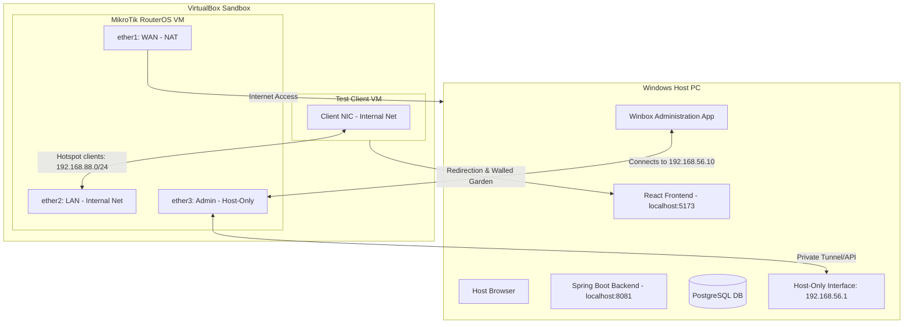

# Local Practice Guide: MikroTik RouterOS in VirtualBox

This guide explains how to set up a complete **MikroTik RouterOS Cloud Hosted Router (CHR)** simulation environment using **VirtualBox** on your Windows host. This allows you to practice configuring and testing the **BilluNet Captive Portal** locally without needing physical router hardware.

---

## Architecture Overview



---

## Prerequisites

1. **Oracle VM VirtualBox**: [Download and install](https://www.virtualbox.org/wiki/Downloads) VirtualBox for Windows.
2. **MikroTik CHR Disk Image**: 
   * Go to [MikroTik Downloads page](https://mikrotik.com/download).
   * Scroll down to **Cloud Hosted Router (CHR)**.
   * Under **VDI Image**, download the latest **Stable** version (e.g. `chr-7.x.x.vdi`).
3. **Test Client VM**: A lightweight VM (e.g. Lubuntu, alpine-desktop, or a standard Windows/Ubuntu VM) to simulate a client connecting to Wi-Fi.

---

## Step 1: Create the MikroTik CHR VM in VirtualBox

1. Open VirtualBox and click **New**.
2. Set the following parameters:
   * **Name**: `MikroTik-CHR`
   * **Type**: `Linux`
   * **Version**: `Linux (64-bit)`
   * **Base Memory**: `256 MB` (128 MB is also sufficient; RouterOS has a very small footprint).
   * **Processors**: `1 CPU`.
3. In the **Hard Disk** settings:
   * Choose **Use an Existing Virtual Hard Disk File**.
   * Click the folder icon, click **Add**, and select the `chr-x.x.vdi` file you downloaded.
   * Click **Create**.

---

## Step 2: Configure VirtualBox Network Adapters

This is the most critical phase. We configure three network interfaces on the VM to mimic a physical router deployment:

1. Select the `MikroTik-CHR` VM and click **Settings** -> **Network**.
2. **Adapter 1 (WAN/Internet)**:
   * Enable Network Adapter.
   * Attached to: **NAT**.
   * *This represents `ether1`. It automatically obtains an IP from VirtualBox's NAT engine and gives the router internet access.*
3. **Adapter 2 (Hotspot Client LAN)**:
   * Enable Network Adapter.
   * Attached to: **Internal Network**.
   * Name: `hotspot-lan`.
   * *This represents `ether2`. Captive portal clients connect here. It has no physical link to the host, ensuring traffic isolation.*
4. **Adapter 3 (Admin Management Interface)**:
   * Enable Network Adapter.
   * Attached to: **Host-only Adapter**.
   * Name: Select your VirtualBox Host-Only Ethernet Adapter (typically `VirtualBox Host-Only Ethernet Adapter`).
   * *This represents `ether3`. It allows your Windows Host PC to communicate directly with the VM to access the Web REST API and manage the router via Winbox.*

---

## Step 3: Boot the Router & Configure Admin Management IP

1. **Start** the `MikroTik-CHR` VM.
2. When the login prompt appears:
   * **Login**: `admin`
   * **Password**: *Leave blank (press Enter)*.
3. Read or skip the software license terms (`n` to skip).
4. Set a strong password when prompted (e.g., `admin`).
5. Run the following command in the console to assign a static IP to `ether3` (the Host-only interface):
   ```routeros
   /ip address add address=192.168.56.10/24 interface=ether3 network=192.168.56.0
   ```
   *(Note: Adjust the IP subnet to match your VirtualBox Host-Only Adapter's IP address. If your host-only adapter is `192.168.56.1`, then `192.168.56.10` works perfectly).*
6. Verify the IP is assigned:
   ```routeros
   /ip address print
   ```

---

## Step 4: Access the Router via Winbox

1. Download and run **Winbox** from [MikroTik's website](https://mikrotik.com/download).
2. Under the **Neighbors** or **Connect to** field, type **`192.168.56.10`**.
3. Enter your username `admin` and the password you set.
4. Click **Connect**. You now have full GUI access to the virtualized router!

---

## Step 5: Configure WAN, LAN Bridge, and DHCP

In Winbox, open the **Terminal** or configure using the CLI to set up DHCP for hotspot clients:

```routeros
# 1. Create a bridge for Hotspot clients (representing your local AP / switches)
/interface bridge add name=bridge-hotspot

# 2. Add ether2 (Internal Network) to the hotspot bridge
/interface bridge port add bridge=bridge-hotspot interface=ether2

# 3. Assign local gateway IP to the hotspot bridge
/ip address add address=192.168.88.1/24 interface=bridge-hotspot network=192.168.88.0

# 4. Create an IP Pool for hotspot clients
/ip pool add name=hotspot-pool ranges=192.168.88.10-192.168.88.254

# 5. Configure DHCP Server on the hotspot bridge
/ip dhcp-server add address-pool=hotspot-pool disabled=no interface=bridge-hotspot name=dhcp-hotspot

# 6. Configure the DHCP Server Network (gateway & dns servers)
/ip dhcp-server network add address=192.168.88.0/24 gateway=192.168.88.1 dns-server=8.8.8.8,1.1.1.1

# 7. Configure masquerading (NAT) for internet sharing from ether1
/ip firewall nat add chain=srcnat action=masquerade out-interface=ether1 comment="NAT to Internet"
```

---

## Step 6: Configure the Hotspot & Redirection

We will now enable the hotspot portal and configure the redirect logic to point to the local developer server running on the Host PC (`192.168.56.1`).

1. **Configure Hotspot Profiles**:
   ```routeros
   /ip hotspot user profile add name=billunet-profile shared-users=1
   /ip hotspot profile add name=hsprof-billunet hotspot-address=192.168.88.1 login-by=http-pap use-radius=no
   /ip hotspot add name=hs-billunet interface=bridge-hotspot address-pool=hotspot-pool profile=hsprof-billunet disabled=no
   ```
2. **Configure the Walled Garden** (Allows unauthenticated clients to fetch portal assets from your host PC):
   ```routeros
   /ip hotspot walled-garden
   add dst-host=192.168.56.1 action=allow
   ```
3. **Upload the Redirect Template**:
   Create a file named `login.html` on your computer with the following contents:
   ```html
   <!DOCTYPE html>
   <html>
   <head><meta charset="utf-8"></head>
   <body>
   <script>
   window.location.href =
     "http://192.168.56.1:5173/?" +
     "clientmac=$(mac)&clientip=$(ip)" +
     "&router_code=DEV-ROUTER-01" +
     "&link_login=$(link-login-only)&link_orig=$(link-orig-esc)";
   </script>
   </body>
   </html>
   ```
   * Open the **Files** section in Winbox.
   * Drag and drop this `login.html` into the **`flash/hotspot/`** (or **`hotspot/`** on older systems) directory on the router, overwriting the default file.

---

## Step 7: Configure the Test Client VM

1. Select your client test VM (e.g. Lubuntu) and open **Settings** -> **Network**.
2. Set Adapter 1 to **Internal Network** with the exact name **`hotspot-lan`**.
3. Start the test client VM.
4. Open a terminal or network status panel inside the client VM to verify it has received an IP in the `192.168.88.x` range (e.g. `192.168.88.254`).

---

## Step 8: Verify the Captive Flow Locally

1. Start your local PostgreSQL server on the Host PC.
2. In the `backend` folder on the Host PC, run the Spring Boot app:
   ```bash
   mvn spring-boot:run
   ```
3. In the `frontend-wifi` folder on the Host PC, run the React frontend:
   ```bash
   npm run dev -- --host
   ```
   *(Note: The `--host` flag ensures Vite listens on all interfaces, allowing the Guest VM to connect to the dev server via `192.168.56.1:5173`).*
4. Open the web browser inside the **Test Client VM** and navigate to any HTTP site (for example, `http://neverssl.com`).
5. **Redirection Action**: The browser should immediately redirect you to:
   `http://192.168.56.1:5173/?clientmac=XX:XX:XX:XX:XX:XX&clientip=192.168.88.254&router_code=DEV-ROUTER-01...`
6. Go through the captive portal registration flow, purchase plans, and complete the authentication practice successfully!
